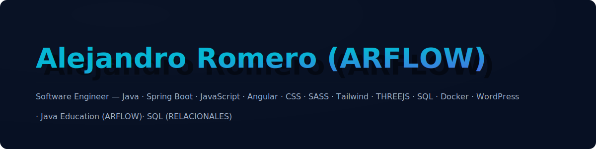

<!-- Banner -->

  

 

# 👋 Hi, I'm **Alejandro Romero (ARFLOW)**  
**Software Engineer**

Apasionado por el desarrollo de software, especializado en backend con Java/Spring Boot y en frontend moderno. Además, comparto contenido educativo sobre Java en redes sociales bajo el nombre **ARFLOW**.

---

## 🚀 **Tecnologías que uso**

### 🖥️ Backend
- **Java**
- **Spring Boot**

### 💻 Frontend
- **JavaScript**
- **Angular**
- **CSS / SASS**
- **Tailwind CSS**
- **BEM**
- **HTML**

### 🧰 DevOps & Tools
- **Docker**

### 🗄️ Bases de Datos
- **PostgreSQL**
- **MySQL**
- **SQL Server**
- **Oracle**

### 🎨 Otros
- **WordPress**

---

## 🧪 Proyectos y retos
Revisa mis soluciones y retos completados en **Frontend Mentor**:  
👉 https://www.frontendmentor.io/profile/Alejosv07

---

## 🌐 Conectemos
- TikTok (Java Education): **ARFLOW**

---
